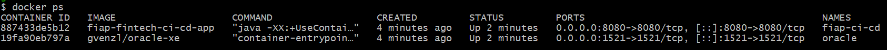

# Projeto - Fintech

## 🚀 Como executar localmente com Docker

### Pré-requisitos

* Docker instalado
* Docker Compose instalado

### Passos para execução

1. Clone o repositório:

```bash
git clone https://github.com/GustavoMoraesFonseca/fiap-fintech-ci-cd.git
cd fiap-fintech-ci-cd
```

2. Build e subida dos containers:

```bash
docker-compose up --build
```

3. Acesse a aplicação:

* API: [http://localhost:8080](http://localhost:8080)
* Banco Oracle: localhost:1521

---

## 🔄 Pipeline CI/CD

O projeto utiliza **GitHub Actions** como ferramenta de CI/CD.

### 🔧 Etapas do pipeline:

1. **Checkout do código**

   * Clona o repositório automaticamente.

2. **Build da aplicação**

   * Executa `mvn clean install` para compilar o projeto.

3. **Testes automatizados**

   * Executa `mvn test` garantindo a integridade da aplicação.

4. **Deploy em Staging**

   * Executado ao realizar push na branch `develop`.

5. **Deploy em Produção**

   * Executado ao realizar push na branch `main`.

### ⚙️ Funcionamento

* O pipeline é acionado automaticamente a cada push.
* Garante que apenas código validado seja promovido entre ambientes.

---

## 🐳 Containerização

### 📄 Dockerfile utilizado:

```dockerfile
FROM maven:3.9.9-eclipse-temurin-17 AS build

WORKDIR /app

COPY pom.xml .
RUN mvn dependency:go-offline -B

COPY src ./src
RUN mvn clean package -DskipTests

FROM eclipse-temurin:17-jdk-alpine

WORKDIR /app

RUN addgroup -S spring && adduser -S spring -G spring

COPY --from=build /app/target/*.jar app.jar

RUN chown spring:spring app.jar

USER spring

EXPOSE 8080

ENTRYPOINT ["java", "-XX:+UseContainerSupport", "-XX:MaxRAMPercentage=75.0", "-jar", "app.jar"]
```

### 🧠 Estratégias adotadas:

* **Multi-stage build**: reduz o tamanho da imagem final
* **Cache de dependências**: melhora o tempo de build
* **Execução com usuário não-root**: aumenta a segurança
* **Otimização da JVM para containers**

---

## 📸 Prints do funcionamento

### Sugestões de evidências:

* Execução do `docker-compose up`
* Pipeline rodando no GitHub Actions
* Aplicação respondendo no navegador (localhost:8080)
* Logs do container
* Deploy em staging e produção

> Inserir imagens ou links aqui

---

---

## 🛠️ Tecnologias utilizadas

* Java 17
* Spring Boot
* Maven
* Docker
* Docker Compose
* Oracle XE
* GitHub Actions

## 📌 Observações

Este projeto demonstra a implementação de práticas modernas de DevOps, incluindo integração contínua, entrega contínua e containerização de aplicações.
